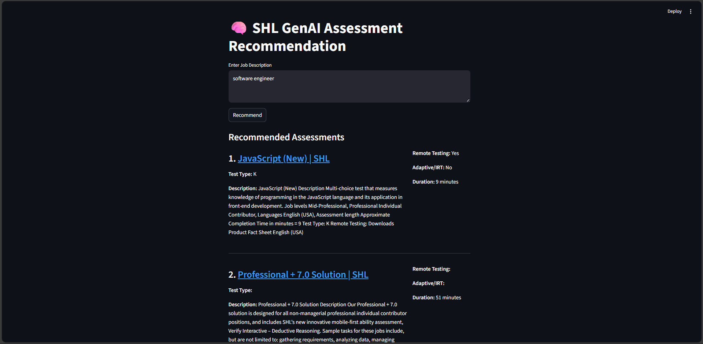

# Assessment Recommender System (RAG-Based)

A **Retrieval-Augmented Generation (RAG)** system that intelligently recommends **SHL assessments** from natural-language queries.

The system combines **semantic vector search (FAISS + SentenceTransformers)** with **Google Gemini LLM** to generate **context-aware, explainable, and reliable** recommendations.

Built with a **production-oriented ML engineering mindset** — focusing on clean architecture, evaluation, and graceful failure handling.

🔗 **Live Demo**
👉 [https://jclg3riyas8cdlxmcdfcxs.streamlit.app/](https://jclg3riyas8cdlxmcdfcxs.streamlit.app/)

---

## 🚀 Key Features

### 🔍 Semantic Retrieval (Not Keyword Matching)

* Uses **SentenceTransformers (`all-MiniLM-L6-v2`)**
* Understands intent beyond exact keyword overlap
* Retrieves the most relevant assessments using **FAISS**

### 🤖 LLM-Augmented Recommendations

* Integrates **Google Gemini 1.5 Flash**
* Generates **natural-language explanations** describing *why* each assessment is recommended

### 🧱 Robust Data Ingestion Pipeline

* Supports **JSON, CSV, and Excel**
* Automatically normalizes column names
* Extracts metadata (e.g., assessment duration) from unstructured text using **regex**

### 🔄 Hybrid Output Design

* **Human-readable summaries** for end users
* **Structured JSON output** for APIs or downstream systems

### 🧪 Built-in Evaluation (Recall@K)

* Measures retrieval accuracy using **Recall@K**
* Validates embedding quality using known-item search
* Outputs evaluation results for offline analysis

### 🛡 Reliable Fallback Strategy

* If the LLM is unavailable or rate-limited:

  * The system still returns **structured semantic search results**
* Ensures consistent behavior in production environments

---

## 📸 Screenshots & Demo

### 🔹 Live Recommendation Flow

Natural-language input → semantic retrieval → explainable recommendations.

```md

```

> ℹ️ Convert `working_video.mp4` → `.gif` for better GitHub autoplay support.

---

### 🔹 System Architecture (RAG Flow)

```md

```

---

### 🔹 Streamlit Web Interface

```md

```

---

## 🧠 System Architecture (High-Level)

1. **Ingestion Layer**

   * Loads SHL catalog
   * Cleans and normalizes data
   * Creates combined text fields for embedding

2. **Embedding & Vector Store**

   * Generates dense embeddings using SentenceTransformers
   * Stores vectors in **FAISS** for fast similarity search

3. **RAG Engine**

   * Retrieves top-K relevant assessments
   * Enriches the prompt with retrieved context
   * Sends it to **Gemini LLM** for explanation generation

4. **Evaluation Module**

   * Computes **Recall@K**
   * Exports results for analysis

---

## 📁 Project Structure

```bash
shl/
├── data/
│   ├── shl_products.json     # Source assessment catalog
│   └── faiss_index/          # FAISS vector store
├── outputs/
│   ├── evaluation_results.csv
│   └── recommendations.json
├── src/
│   ├── config.py             # Global configuration
│   ├── embeddings/           # Embedding logic
│   ├── ingestion/            # Data loading & cleaning
│   ├── rag/                  # RAG engine
│   └── evaluation/           # Recall@K evaluation
├── images/                   # Screenshots & diagrams
├── requirements.txt
└── .env
```

---

## ⚙️ Installation & Setup

### 1️⃣ Clone the Repository

```bash
git clone https://github.com/yashmishra1234567890/SHL.git
cd SHL
```

### 2️⃣ Create & Activate Virtual Environment

```bash
python -m venv .venv
```

**Windows**

```bash
.venv\Scripts\activate
```

**Mac / Linux**

```bash
source .venv/bin/activate
```

### 3️⃣ Install Dependencies

```bash
pip install -r requirements.txt
```

### 4️⃣ Configure Environment Variables

Create a `.env` file:

```env
GEMINI_API_KEY=your_api_key_here
```

---

## ▶️ Usage

### 🔹 Run the Recommendation Engine

```bash
python src/rag/rag_engine.py
```

Outputs:

* Human-readable recommendation summary
* Structured JSON output

---

### 🔹 Run Retrieval Evaluation

```bash
python src/evaluation/run_eval.py
```

Results saved to:

```bash
outputs/evaluation_results.csv
```

---

## ⚙️ Configuration

Edit `src/config.py` to customize:

* `CATALOG_PATH` – SHL catalog file path
* `TOP_K` – Number of retrieved assessments
* `EMBEDDING_MODEL` – SentenceTransformer model
* `GEMINI_MODEL` – Gemini LLM version

---

## 🧪 Evaluation Methodology

* Uses **Recall@K** to measure retrieval performance
* Checks whether the correct assessment appears in top-K results
* Suitable for:

  * Known-item search
  * Recommendation systems
  * RAG retrieval validation

---

## 🛠 Tech Stack

* **Python 3.12**
* **LangChain**
* **FAISS**
* **SentenceTransformers (HuggingFace)**
* **Google Gemini 1.5 Flash**
* **Pandas**
* **Streamlit**

---

## 📌 Use Cases

* Automated SHL assessment recommendation from job descriptions
* HR-tech and recruitment platforms
* Skill-based assessment discovery
* GenAI-powered search & recommendation demos

---
